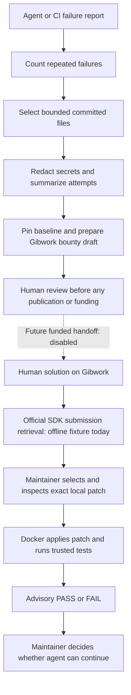

# ESCALATE

When an AI coding agent repeatedly fails, **ESCALATE prepares a bounded, secret-redacted human handoff through Gibwork and validates the returned solution before the agent continues**. This TypeScript CLI preserves failed attempts, selects relevant committed files and tests a candidate patch against a pinned Git baseline.

Built for the Gibwork Developer Hackathon. Agent continuation is a maintainer decision; ESCALATE does not automatically resume or merge.

**Safe by default:** the three product commands and demo use offline transport. Real Gibwork authenticated read access was successfully verified using official SDK **0.2.0** and one manually approved Phantom message signature. **Bounty publication, funding, transaction signing and every monetary operation remain intentionally disabled.**

## Reproduce the offline demo in under 5 minutes

**Node.js 22+ → `npm ci` → `npm run demo`.** Git must also be installed. Clone or download this repository, open a terminal in its root (the folder containing `package.json`), then run:

```sh
git clone https://github.com/hemazy654/escalate-gibwork.git
cd escalate-gibwork
npm ci
npm run demo
```

No Docker, wallet or API key is needed. Dependency installation is the only network step. The demo itself is offline and normally completes in 10–30 seconds after installation. It creates a deterministic temporary TypeScript Git repository with a retry-policy bug, proves the baseline tests fail, detects three reported failed AI attempts, packages/redacts committed context, generates a Gibwork-compatible draft, retrieves the mock human submission through the official SDK, applies its exact patch and proves the tests pass.

Terminal output walks through six numbered stages. Inspect `.escalate/demo/{diagnosis,bounty,review,validation}.json` afterward. The proposed 25.00 USDC reward is never funded. The credential canary and historical attempt report are explicitly synthetic; FAIL and PASS are real test results.

**The demo runner executes only the bundled trusted fixture locally, with `isolation: "none"`.** It is not a Docker sandbox and cannot accept arbitrary submissions. Production `escalate review` retains its Docker-only validation path, with no host-execution bypass.

For JSON without npm banners, run `npm run --silent demo -- --json`. The normal CLI commands continue to emit JSON. Repeated runs produce identical baseline/context/patch identities; test timings naturally vary. Artifacts are ignored by Git and refreshed on each successful run; temporary checkouts are removed.

## What is real, and what is simulated?

| Path | Verified behavior | Boundary |
| --- | --- | --- |
| Offline demo | Actual failing/passing tests, patch application, redaction and official SDK request handling | Synthetic AI attempt history and human submission; in-memory Gibwork transport; trusted local execution with **no isolation** |
| Production validator | Actual Docker execution, FAIL/PASS, resource limits and network/filesystem/privacy probes | Maintainer-selected local patch and trusted preloaded image; verdict is advisory |
| Live Phase A | SDK 0.2.0 `tasks.listAvailable({page:1,limit:1})`; **HTTP 200**, authenticated read, **one request** on 2026-10-06 | Manual Phantom message approval; no transaction or monetary operation; live submission retrieval is not wired into `review` |
| Phase B pre-flight | Local spending-cap/transaction-review tests; cumulative **1.50 USDC / 0.01 SOL** policy caps | No real prepare intent or fee quote; unknown escrow effects fail closed; no signing/funding path |

The separate `verify:live:phantom` utility can request a manually approved read; it is not part of first-run setup or the recording. No credentials are needed to judge the offline demo. Read authentication does not establish payment or settlement compatibility.

See [the recording checklist](docs/DEMO.md), [judging brief](docs/JUDGING.md), [submission copy](docs/SUBMISSION.md) and [security boundaries](SECURITY.md).

**Recording/screenshots to attach:** a 2–3 minute demo video, one FAIL→PASS terminal capture, and one redacted bounty-draft capture. These are pending capture; no screenshot or live-funded bounty is claimed.

## Install and check

```sh
npm ci
npm run check
npm test
npm run build
node dist/cli.js --help
# Optional: install the executable locally
npm link
```

`.env.example` documents safe offline defaults. ESCALATE does not implicitly load `.env` or consume wallet credentials. You can use `node --env-file=.env dist/cli.js ...`, although configuration is unnecessary for offline use.

## Commands

Run against a Git repository with a committed baseline and tracked source files. `--repo` defaults to the current directory. All commands emit JSON on stdout; structured operational logs and errors go to stderr. Exit 0 indicates successful command execution (or validation PASS); exit 1 indicates invalid input, operational failure or validation FAIL. Diagnose reports the escalation decision in JSON without returning a failing process exit merely because an agent failed.

```sh
node dist/cli.js diagnose --report examples/failure.json --repo /path/to/repository
node dist/cli.js create --report examples/failure.json --repo /path/to/repository \
  --amount 25.00 --mint EPjFWdd5AufqSSqeM2qN1xzybapC8G4wEGGkZwyTDt1v
node dist/cli.js review example-task --fixtures examples/submissions.json
```

`diagnose` accepts an explicit failure report supplied by an agent or CI adapter. It counts trailing consecutive failures; any successful attempt resets the count. The default threshold is 3, configurable with `--threshold` (integer 2–100). There is no automatic agent log watcher in this release.

Report format:

```json
{
  "task": "Fix the parser regression",
  "files": ["src/parser.ts", "tests/parser.test.ts"],
  "attempts": [
    {"summary": "Changed parser bounds", "outcome": "fail", "output": "Expected 2, got 1"}
  ]
}
```

Attempts must be in chronological order. Task descriptions, summaries and output are bounded and schema validated. Summaries are deterministic records of the supplied attempts; no external LLM receives repository content.

`create` requires the threshold to be met and writes a private, exclusively created JSON file under `.escalate/` (or `--out`). It contains the redacted context, pinned baseline, attempt summaries, acceptance criteria, SHA-256 context digest, proposed SDK bounty payload, and an explicit approval-required marker. Proposed amounts are decimal strings, never floating-point conversions for payment. Identical context drafts cannot overwrite one another. The digest covers context; inspect the exact proposed reward/mint separately because they are outside that digest. File permissions are best effort on non-POSIX systems.

`review <task-id>` retrieves matching fixture submissions through the official SDK. Fixture format is shown in `examples/submissions.json`; up to 100 entries are supported. Submission content is untrusted and redacted. URLs are never opened or downloaded automatically.

## Isolated validation

The maintainer must select a submission, inspect and obtain its local patch, pin a baseline, select a trusted Docker image digest and supply the test arguments. ESCALATE never infers a command from submission content. The local patch is associated with the selected submission by the maintainer; the platform does not cryptographically prove that association.

```sh
node dist/cli.js review example-task --fixtures examples/submissions.json \
  --submission example-submission --patch /path/to/solution.patch \
  --repo /path/to/repository --baseline <40-or-64-character-commit-sha> \
  --image 'your-validation-image@sha256:<64-character-digest>' \
  --test-argv '["node","--test"]'
```

The preloaded image must contain Node, Git, and any trusted dependencies your test suite needs. You can use a registry digest or a full local `sha256:` image ID. Images are never pulled by ESCALATE; prepare dependencies beforehand. The runner exports the committed baseline rather than the current worktree. It rejects sensitive paths, symlinks, submodules, binary files, oversized files and repositories larger than 10 MB. It supports text patches up to 1 MB.

The runner mounts only a temporary baseline/patch bundle read-only, copies it into ephemeral storage inside the container, checks/applies the patch, then runs the exact argument array without a shell. Network is disabled, root filesystem is read-only, capabilities are dropped, privilege escalation is disabled, and CPU, memory, PID, output and time limits apply. No Docker socket, host environment secrets, wallet files or original repository are mounted. A container is forcibly removed after completion or timeout.

PASS means only that patch application and the selected command exited 0. FAIL includes nonzero exits and time/output limits; setup errors fail the CLI without a PASS verdict. Reports include the baseline, image, command and patch digest. There are no payouts, approvals or automatic merges. A patch can alter tests: the maintainer must assess test integrity and whether the command actually checks the acceptance criteria. Docker shares a kernel; hostile native code warrants a dedicated disposable VM and hardened daemon. Milestone 3 verifies actual container execution on an Apple silicon macOS test environment; see [Docker validation](docs/DOCKER.md) for commands, runtime probes and evidence. Unit tests also verify orchestration with an injected Docker runner. The separate bundled demo provides real local test execution and clearly reports that it has no isolation.

## Architecture



The demo uses a mock human submission and the restricted local runner in place of Docker. The independently verified discovery read and non-signing spending review are separate utilities.


- `src/core/failure.ts`: strict input validation and consecutive-failure detection.
- `src/core/context.ts`: committed Git bounded context selection, explicit file hints, task/path relevance and exclusions.
- `src/core/repository.ts`: shared bounded Git snapshot reading/export.
- `src/demo/`: deterministic story and restricted trusted local fixture runner.
- `src/core/redact.ts`: common credential formats, private-key blocks, JWTs, assignments and authenticated URLs.
- `src/core/brief.ts`: deterministic handoff and context digest.
- `src/gibwork/gateway.ts`: official SDK-backed offline retrieval, SDK payload construction and unconditional denial of financial operations.
- `src/validation/sandbox.ts`: pinned baseline export, isolated patch application/test execution and advisory verdict.
- `src/core/process.ts`: no-shell execution, separated stdout/stderr, bounded output and timeout.
- `src/cli.ts`: commands, private draft persistence, structured errors and logs.

Redaction is heuristic, not a guarantee. Review every draft before sharing it, particularly source literals, encoded credentials, personal data and proprietary code. Scanner exclusions are conservative; untracked files never enter drafts; committed files remain subject to path exclusions, selected files are limited to 20, 32 KB each and 128 KB total. Context is read directly from committed Git blobs at the pinned baseline; uncommitted changes and newly staged files are excluded. Use the repository root for `--repo` and commit the intended reproduction baseline first. Supply accurate file hints for the best context; this release does not perform dependency-graph selection. Deleted or replaced worktree paths do not change the committed context.

## Actual Docker checks (Milestone 3)

With Docker Desktop running and dependencies installed:

```sh
docker pull node:22-bookworm
npm run docker:prepare
npm run test:docker
```

These commands are separate from the offline demo. They execute actual production validation, including the `escalate review` path, and save evidence in `.escalate/docker-validation.json`. See [docs/DOCKER.md](docs/DOCKER.md) for the full preparation and boundary-check details. No Gibwork operation goes live.

## Integration research and verification

See `docs/GIBWORK.md` for inspected official APIs, version evidence, hackathon comparison and the future live-testing gate. See `docs/PLAN.md` for the initial plan and architecture.

The mock verifies local submission contracts. Phase A separately verified one real authenticated discovery read; no live submission, task preparation, payment quote or settlement has been tested. The [pre-flight](docs/PREFLIGHT.md) records unresolved minimums, fees and refund rules. The [spending guard](docs/SPENDING-GUARD.md) refuses unknown transaction effects and never requests a transaction signature. Never retry ambiguous financial operations automatically.

## Quality and limitations

Tests also exercise the complete demo twice, require deterministic identities, verify the real FAIL-to-PASS transition, refuse external demo patches/baselines, and preserve committed context despite worktree replacement. Tests cover input bounds, consecutive-failure resets, secret redaction, deterministic briefs, scanner exclusions, real SDK mock retrieval, financial denial, HTML escaping, runner resource configuration, verdicts, time/output limits, and all three CLI commands including duplicate draft prevention.

The current dependency audit reports five moderate entries in the SDK's Solana dependency chain (`jayson`, `stream-json`, `uuid` plus affected parents). No automatic compatible fix is reported. These remain unresolved dependency concerns; passing tests and one harmless live read do not remove them. SDK 0.2.0 also declares `UNLICENSED`; obtain upstream licensing clarification before redistribution. ESCALATE's own source is MIT licensed.

## Phase A and pre-flight utilities

[Live read verification](docs/LIVE-READONLY.md) documents the successful authenticated GET and its strict one-request boundary. [Phantom signing](docs/PHANTOM.md) describes the verified browser bridge; it receives only public keys/signatures, never wallet secrets. The standalone `verify:live` command still defaults offline and has no signer loader.

`npm run inspect:prepared -- --file prepared-review.json` reviews an existing local artifact. Optional `--rpc` permits independent Solana read RPCs. Neither mode prepares, signs, submits or publishes a bounty. No real artifact was obtained because the service has not documented side-effect-free preparation. See [SPENDING-GUARD.md](docs/SPENDING-GUARD.md).

## License and publication

ESCALATE source is [MIT licensed](LICENSE). Official SDK 0.2.0 declares **UNLICENSED**; ESCALATE's MIT license does not relicense it. Seek upstream clarification before redistributing SDK code or bundled dependencies. Dependencies and local evidence are not committed. The package is marked private to prevent accidental npm publication.

Feature-complete candidate: `9923a4433d882a01270eeeee17144b1dfc91e951`. Submission preparation changes documentation/metadata only. See [publication audit](docs/PUBLICATION.md) for findings and manual release steps.
